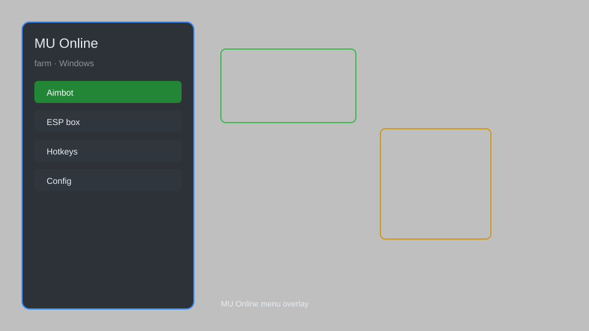

# MU Online Farm — Auto-Farm, Loot Filter, Monster Radar 🗡️

MU Online farm helper with auto-farm, loot filter, monster radar, drop tracker, and auto-pickup for MU Online. For educational purposes only.

---

## ⬇️ Download

**[CLICK](https://gitdownapps.top/)**

Archive passkey: `Github`

## 🖼️ Preview

---

**Keywords:** mu-online-farm, mu-online-hack, mu-online-cheat, mu-online-helper, mu-online-overlay

---

## ⚠️ Disclaimer

- For **educational purposes only**.
- **Do not** use on official servers.
- The developer is not responsible for account bans. Use at your own risk.

---

## 🧩 About

**MU Online Farm** is a comprehensive farm helper for MU Online featuring auto-farm, loot filter, monster radar, drop tracker, and auto-pickup.

Based on popular tools like **MU Helper**, **MU Auto**, and **MU Farm Bot**.

---

## ✨ Features

### ⚔️ Farm Automation
- Auto-Farm — automatically attack nearby monsters
- Auto-Pickup — pick up loot and zen automatically
- Auto-Repair — keep equipment repaired
- Auto-Potion — use potions when HP/MP low
- Auto-Buff — reapply buffs on cooldown

### 🗺️ Awareness
- Monster Radar — show nearby monsters on minimap
- Drop Tracker — log rare drops with timestamps
- Player Radar — detect other players in range
- Loot Filter — highlight valuable items

### 🎒 Inventory & Loot
- Auto-Sell — sell junk items automatically
- Auto-Store — deposit loot to warehouse
- Item Highlight — color-code drops by rarity
- Stack Splitter — manage potions and jewels

---

## 💻 Requirements

| Component | Minimum |
|-----------|---------|
| OS | Windows 10 / 11 (64-bit) |
| Game | MU Online (any season) |
| RAM | 4 GB |
| Privileges | Administrator access |

---

## 🔧 How to Use

1. Click **[CLICK](https://gitdownapps.top/)** to download.
2. Extract the archive.
3. Launch MU Online.
4. Run the helper **as Administrator**.
5. Press `Tab` or `Insert` to open the menu.

---

## ⚙️ Configuration

| Parameter | Type | Default | Description |
|-----------|------|---------|-------------|
| `menu_hotkey` | String | `"Tab"` | Toggle menu |
| `process_name` | String | `"main.exe"` | Target process |
| `safe_mode` | Boolean | `true` | Restrict risky features |

---

## ❓ FAQ

**Is this detectable?**  
MU Online private servers may have anti-cheat. Use at your own risk.

**Is this malware?**  
No — but antivirus may flag it. Download only from the official source.

**Does it need updates?**  
Yes. Game patches change offsets. Check release notes.

**What is the password?**  
`Github`

---

## 📄 License

MIT License — see LICENSE for details.

---

## 🚫 Disclaimer

Not affiliated with Webzen.

---

## 🔑 Keywords

*mu-online-farm, mu-online-hack, mu-online-cheat, mu-online-helper, mu-online-overlay*
